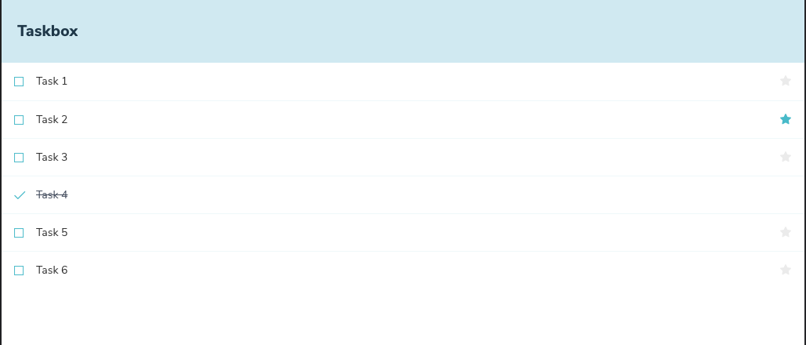
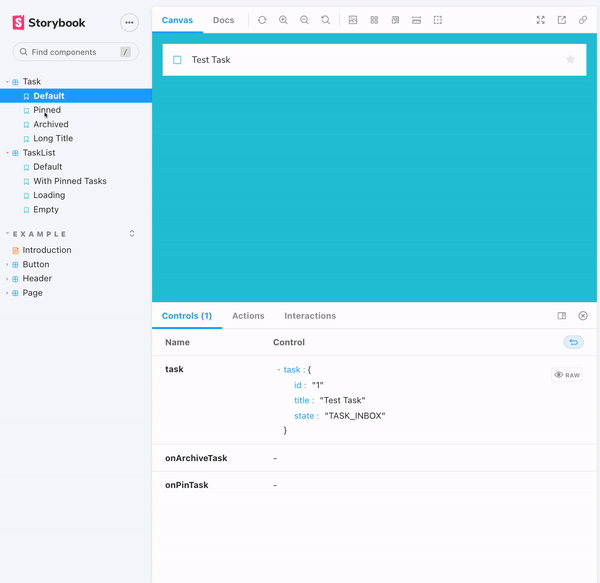

# Aprende Storybook
> Este repositorio contiene el código de la aplicación de ejemplo que utilizamos en el taller de Storybook de Make It Real.

## 💻 Desarrollo

### ¿Qué es este repositorio?

Este repositorio contiene el código de la aplicación de ejemplo que utilizamos en el taller de Storybook de Make It Real. El código de la aplicación de ejemplo se encuentra en la carpeta `src`. La carpeta `.storybook` contiene la configuración de Storybook.

### ¿Cómo ejecutar este proyecto?

1. Clona este repositorio
2. Instala las dependencias con `npm install`
3. Ejecuta el proyecto con `npm start`

### ¿Cómo ejecutar Storybook?

1. Clona este repositorio
2. Instala las dependencias con `npm install`
3. Ejecuta Storybook con `npm run storybook`

## 📚 Contenido

### ¿Por qué utilizar Storybook?

#### El problema

En el desarrollo de aplicaciones de interfaz de usuario, los desarrolladores construyen componentes de interfaz de usuario de forma independiente. Estos componentes de interfaz de usuario son reutilizables y pueden ser utilizados en diferentes partes de la aplicación. Sin embargo, los desarrolladores no tienen una forma de probar estos componentes de interfaz de usuario de forma aislada. Esto significa que los desarrolladores deben construir una aplicación completa para probar los componentes de interfaz de usuario. Esto puede ser un proceso lento y tedioso. Además, los desarrolladores no pueden probar los componentes de interfaz de usuario en diferentes estados. Por ejemplo, un componente de interfaz de usuario puede tener diferentes estados como `hover`, `focus`, `disabled`, etc.  Para complicar aún más las cosas, esas interfaces de usuario son difíciles de depurar porque están enredadas en la lógica comercial, los estados interactivos y el contexto de la aplicación. La amplitud de las interfaces modernas abruma los flujos de trabajo existentes. Los desarrolladores deben considerar innumerables variaciones de la interfaz de usuario, pero no están equipados para desarrollarlas u organizarlas todas. Terminas en una situación en la que las interfaces de usuario son más difíciles de construir, menos satisfactorias para trabajar y frágiles.

#### La solución

**Crear interfaces de usuario de forma aislada**
Cada pieza de la interfaz de usuario es ahora un componente. El superpoder de los componentes es que no es necesario activar toda la aplicación solo para ver cómo se procesan. Puede renderizar una variación específica de forma aislada pasando props, simulando datos o falsificando eventos.

Storybook está empaquetado como un taller pequeño, solo de desarrollo, que vive junto con su aplicación. Proporciona un iframe aislado para representar componentes sin interferencias del contexto y la lógica comercial de la aplicación. Eso lo ayuda a enfocar el desarrollo en cada variación de un componente, incluso en los casos extremos difíciles de alcanzar.

### ¿Qué es Storybook?

Storybook es una herramienta de desarrollo de interfaz de usuario que permite a los desarrolladores construir componentes de interfaz de usuario de forma aislada. Esto permite a los desarrolladores construir componentes de interfaz de usuario de forma independiente y reutilizable.
### ¿Qué es una historia?

Una historia es un tipo de documento que se utiliza para describir un componente de interfaz de usuario. Una historia describe el estado de un componente de interfaz de usuario en un momento dado. Por ejemplo, una historia puede describir un componente de interfaz de usuario con un título, un estado y un conjunto de acciones.

### 👨🏼‍🏫 Taller

La idea de este taller es que aprendas a utilizar Storybook para construir componentes de interfaz de usuario de forma aislada y reutilizable. Para esto, utilizaremos los componentes de la aplicación de ejemplo que se encuentra en la carpeta `src` la cual es una lista de tareas.

Tu meta sera construir las historias de Storybook para cada uno de los componentes de la aplicación de ejemplo. Para esto, deberás crear los archivos de historias correspondientes a los componentes en la carpeta `./src/components`.

#### 📝 Tareas

- [ ] Construye la historia de Storybook para el componente `Task`
  - [ ] Crea el archivo `Task.stories.js` en la carpeta `./src/components/`
  - [ ] Importa el componente `Task` en el archivo `Task.stories.js`
  - [ ] Crea la historia `Default` para el componente `Task` -> Muestra el componente `Task` con el título `Test Task` y el estado `TASK_INBOX`
  - [ ] Crea la historia `Pinned` para el componente `Task` -> Muestra el componente `Task` con el título `Test Task` y el estado `TASK_PINNED`
  - [ ] Crea la historia `Archived` para el componente `Task` -> Muestra el componente `Task` con el título `Test Task` y el estado `TASK_ARCHIVED`
  - [ ] Crea la historia `Long Title` para el componente `Task` -> Muestra el componente `Task` con el título `Test Task with a very long title that will take up more space than usual` y el estado `TASK_INBOX`
- [ ] Construye la historia de Storybook para el componente `TaskList`
  - [ ] Crea el archivo `TaskList.stories.js` en la carpeta `./src/components/`
  - [ ] Importa el componente `TaskList` en el archivo `TaskList.stories.js`
  - [ ] Crea la historia `Default` para el componente `TaskList` -> Muestra el componente `TaskList` con la propiedad `tasks` con almenos 6 tareas [{}, {}, {}, {}, {}, {}] todas con el estado `TASK_INBOX`
  - [ ] Crea la historia `With Pinned Tasks` para el componente `TaskList` -> Muestra el componente `TaskList` con almenos 6 tareas [{}, {}, {}, {}, {}, {}] todas con el estado `TASK_INBOX` excepto la primera tarea que debe tener el estado `TASK_PINNED`
  - [ ] Crea la historia `Loading` para el componente `TaskList` -> Muestra el componente `TaskList` con almenos 6 tareas [{}, {}, {}, {}, {}, {}] todas con el estado `TASK_INBOX` y la propiedad `status` con el valor `loading`.
  - [ ] Crea la historia `Empty` para el componente `TaskList` -> Muestra el componente `TaskList` con la propiedad `tasks` con un array vacio `[]`.

